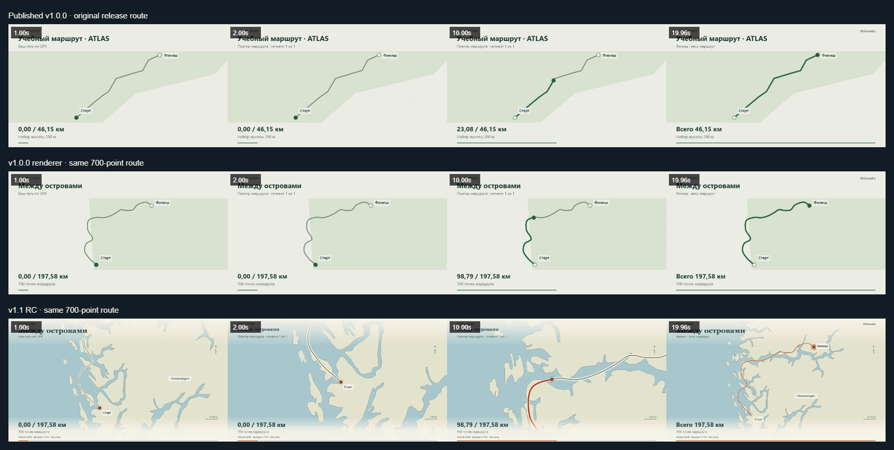

# Route Story

Локальный GPS Route Story Engine от Matawaka. Загрузите GPX, отредактируйте название, выберите 10, 20 или 30 секунд, «Атлас» или «Ночной» и сохраните H.264 MP4 в формате 16:9 или 9:16. Русский интерфейс, Canvas 2D, без обязательного сервера и платных API.

**Стабильная версия v1.0.0:** [открыть приложение](https://matawaka.github.io/route-story/) · [публичный выпуск](https://github.com/Matawaka/route-story/releases/tag/v1.0.0), commit `5f39332b7358949d248da6b2f99ba445ee1b41e8`. Эта ветка готовит отдельный **v1.1.0-rc.1**: детерминированная камера, подробная локальная география и новая композиция видео. [PR #6](https://github.com/Matawaka/route-story/pull/6) требует визуального просмотра владельцем; кандидат ещё не опубликован. Отдельный документационный PR #5 не включён в эту ветку.



Сравнение сделано из декодированных видео. [Night 9:16 и результаты приёмки](docs/CINEMATIC_VALIDATION.md).

Разработка началась **8 октября 2026 года** (Asia/Yekaterinburg). 14 октября — внутренний календарный день семь; отдельный срок подачи организаторами не указан. Владелец сообщил, что заявка v1.0 уже опубликована в закрытом конкурсном Telegram-канале. Агент не отправлял её и не заменяет конкурсные материалы автоматически.

## Локальный запуск

Для подготовки этого выпуска из чистого checkout:

```powershell
git clone https://github.com/Matawaka/route-story.git
cd route-story
git switch feature/cinematic-route-story-v1.1
npm.cmd ci
npm.cmd run build
npm.cmd run preview
```

В Windows PowerShell используйте `npm.cmd` и `npx.cmd`: это запускает командные обёртки Node.js и не требует разрешать выполнение `npm.ps1` или менять ExecutionPolicy. В Linux/macOS используйте `npm` и `npx` без `.cmd`.

```sh
git clone https://github.com/Matawaka/route-story.git
cd route-story
git switch feature/cinematic-route-story-v1.1
npm ci
npm run build
npm run preview
```

Для воспроизведения стабильного выпуска вместо ветки выберите `git switch --detach v1.0.0`. Команды Linux/macOS приведены для воспроизводимости сборки; MP4-кодировщик на этих ОС в текущей приёмке не проверен. Для запуска нужен актуальный браузер с Canvas 2D, File/Blob и XML DOM; для экспорта дополнительно WebCodecs H.264. Общий минимальный объём RAM для всех устройств не установлен.

Откройте адрес localhost, напечатанный Vite (обычно http://127.0.0.1:4173). Для разработки в PowerShell: `npm.cmd run dev`. Требуется Node.js 22.12+; проверено на Node 24.19.0. Экспорт требует HTTPS или localhost и доступного WebCodecs H.264-кодировщика. Приложение проверяет поддержку на выбранных размерах и показывает причину недоступности. На Windows проверены Edge 154, Chrome 154, Playwright Firefox 157 и Chromium 156 с мобильной эмуляцией, включая независимо декодированные MP4 в обоих качествах/форматах. В Playwright WebKit 27.2 на Windows работает предпросмотр, но отсутствует VideoEncoder и экспорт недоступен. Safari, физические Android/iOS и их потребление памяти не проверены. Краткое публичное заявление: [SUPPORTED_PLATFORMS](docs/SUPPORTED_PLATFORMS.md); точные версии, статусы и воспроизведение: [COMPATIBILITY](docs/COMPATIBILITY.md).

## Маршруты, приватность и ограничения

GPX остаётся в памяти браузера: без отправки, сохранения пользовательских маршрутов и телеметрии. Доступны GPX 1.0/1.1 (UTF-8), треки и route points, несколько отдельных сегментов, высота и временные метки при наличии. Расстояние рассчитано по исходным координатам и не включает разрывы. Набор высоты показывается только при полной серии высот; иначе — число точек. Метки времени извлекаются, но не используются для выдуманных скоростей или длительности поездки.

Лимиты: 10 МиБ, 50 000 точек, глубина XML 64, 300 000 элементов; никакой тихой обрезки. DTD/ENTITY, исполняемое содержимое, некорректный XML и координаты отклоняются. Высоты допустимы от −12 000 до 100 000 м. Название/creator до 200 символов, описание до 2 000; длинные поля отклоняются. На кадре длинное название визуально сокращается, исходные точки сохраняются.

В v1.1 режим «Кино» начинает с обзора, приближает карту, сопровождает маркер и возвращается к полному маршруту. Камера вычисляется из времени, поэтому перемотка и экспорт воспроизводят одинаковый кадр. «Классика» сохраняет неподвижную камеру v1.0 и выбирается при системном предпочтении уменьшенного движения. Север остаётся сверху; кратчайшая дуга через 180° и независимые сегменты сохраняются. В разрывах применяется переход, а не выдуманное движение между сегментами.

Локальная карта «Кино» содержит Natural Earth 1:50m (суша, озёра, реки) и небольшой пакет 1:10m западной Норвегии (берег, острова, реальные подписи). В других регионах явно указан обзорный фон. Это не всемирная уличная карта и не навигация; детальность и высокоширотная проекция ограничены. Классический режим использует прежний 1:110m. Все необходимые слои загружаются с того же сайта до начала экспорта. [Архитектура и границы](docs/CINEMATIC_ARCHITECTURE.md), [источники и хеши](docs/GEOGRAPHY_SOURCES.json), [визуальный аудит](docs/VISUAL_UPGRADE_AUDIT.md). Числа рассчитаны по исходным GPX, независимо от камеры. На коротких/стационарных маршрутах приближение ограничено.

По умолчанию видео длится 20 секунд: 2 секунды вступления, 16 секунд повтора, 2 секунды финала. Для 10/30 секунд вступление и финал также занимают по 2 секунды. Вступление показывает название и исходный маршрут, повтор подсвечивает пройденный путь по географическому расстоянию, финал показывает весь маршрут, итоговое расстояние и небольшую подпись Matawaka. В каждом кадре есть второй фактический показатель: набор высоты при полной серии высот либо число точек. Название — 1–200 единиц UTF-16, без управляющих знаков; берётся из метаданных GPX или нейтрального значения по умолчанию. Длинное название визуально сокращается только на кадре; имя файла отдельно ограничено 60 кодовыми точками. Звук отсутствует.

Предпросмотр, перемотка и экспорт используют общий детерминированный таймлайн; FPS и скорость кодирования не меняют движение. Время рядом с ползунком — время видео. Скорость и длительность реальной поездки не выводятся. Для стационарного трека показываются постоянная позиция и нулевое расстояние. Изолированные точки в разных сегментах могут переходить дискретно, без соединяющей линии.

| Качество | 16:9 | 9:16 | FPS | Целевой битрейт |
| --- | --- | --- | --- | --- |
| Совместимое (по умолчанию) | 640×360 | 360×640 | 24 | 1,5 Мбит/с |
| Стандартное | 1280×720 | 720×1280 | 24 | 5 Мбит/с |

Standard проверяется на выбранных размерах. Если кодировщик недоступен, приложение предлагает выбрать совместимое качество; автоматического снижения качества или длительности нет. Экспорт ограничен 30 секундами, 720 кадрами и 32 МиБ закодированных пакетов (+ до 1 МиБ для MP4-контейнера). Это ограничение файла, не измеренный предел общей памяти браузера. Параметры фиксируются перед экспортом, конфликтующие элементы блокируются; отмена и повторный экспорт доступны. Четырёхсекундный режим сохранён только для внутренних регрессионных проверок.

## Проверки

Проверки на Windows с установленным Edge:

```powershell
$env:PLAYWRIGHT_CHANNEL = 'msedge'
npm.cmd run check
```

Или установите Chromium: `npx.cmd playwright install chromium`; без переменной PLAYWRIGHT_CHANNEL тесты используют его. Доступность H.264 зависит от ОС/кодировщика; Windows CI использует Edge. `npm.cmd run test:e2e` требует предварительного `npm.cmd run build`: тестируются dev-сервер и собранный production bundle. Playwright запускает и останавливает свои серверы автоматически.

Независимые FFmpeg и ffprobe проверяют реальный MP4: H.264, размеры, выбранную длительность, 24 FPS, точное число декодированных кадров и изменение изображения. В обычном CI сохранены короткая регрессия 4 с / 96 кадров и ограниченный экспорт Standard 20 с / 480 кадров. Локальные MP4, JSON-отчёты и снимки находятся в игнорируемом `artifacts/`. Полная приёмка 30 секунд в обоих форматах, на 5000 синтетических точках:

```powershell
$env:PLAYWRIGHT_CHANNEL = 'msedge'
$env:FULL_EXPORT_ACCEPTANCE = '1'
npm.cmd run check
Remove-Item Env:FULL_EXPORT_ACCEPTANCE
```

Для отдельной проверки (последний аргумент — длительность; без него используется регрессия 4 секунды):

```powershell
npm.cmd run validate:video -- artifacts/route-story-proof.mp4 640 360
npm.cmd run validate:video -- artifacts/story-standard-30s-landscape.mp4 1280 720 30
```

CI использует только синтетические данные. Учебный пример также синтетический. Реальный публичный Hong Kong Trail проверен отдельно и не включён в репозиторий из-за неразрешённых условий вышестоящих источников: [происхождение и результаты](docs/SAMPLE_PROVENANCE.md).

## Два примера и демонстрация

Опубликованные примеры **стабильного v1.0.0**: [Atlas 16:9 / 20s](https://github.com/Matawaka/route-story/releases/download/v1.0.0/atlas-20s.mp4), [Night 9:16 / 30s](https://github.com/Matawaka/route-story/releases/download/v1.0.0/night-30s.mp4). Большие MP4 не хранятся в source Git. Кандидат v1.1 не заменяет эти файлы.

Для нового визуального примера нажмите **«Попробовать кино-демо · фьорды»**: приложение загружает явно [синтетический GPX](public/samples/cinematic-fjords.gpx), выбирает Кино / 9:16 / 20s / Standard и открывает первый кадр. 700 координат придуманы для демонстрации, это не запись реальной поездки и не рекомендуемый путь. Старые учебные и антимередианные тестовые примеры сохранены. Реальные 20/30-секундные видео кандидата и сравнения воспроизводятся отдельно:

```powershell
node scripts/acceptance/cinematic.mjs
node scripts/acceptance/comparison.mjs
```

Файлы находятся в `artifacts/sprint7/cinematic` и `artifacts/sprint7/comparison`; обе команды независимо декодируют MP4. [Контактные листы и критерии визуальной приёмки](docs/CINEMATIC_VALIDATION.md). Генератор фиксирует данные/параметры; FFmpeg проверяет фактические размеры, FPS, кадры и длительность. Публикация v1.1 требует отдельного разрешения.

Прежняя release-приёмка воспроизводит файлы из [учебного GPX](public/samples/synthetic.gpx) и [перехода через 180°](public/samples/synthetic-antimeridian.gpx):

| Пример | Параметры | Локальный результат |
| --- | --- | --- |
| ATLAS — «Учебный маршрут · ATLAS» | 16:9, 1280×720, 20s, 24 FPS, 480 кадров | `artifacts/release/atlas-20s.mp4` |
| NIGHT — «Через 180° · NIGHT» | 9:16, 720×1280, 30s, 24 FPS, 720 кадров | `artifacts/release/night-30s.mp4` |

```powershell
npm.cmd run build
npm.cmd run release:package
$env:PLAYWRIGHT_CHANNEL = 'msedge'
npm.cmd run release:acceptance
```

Оба файла создаются через интерфейс production-сборки, независимо проверяются FFmpeg/ffprobe и воспроизводятся в native video браузера. Результаты — [COMPETITION_DELIVERY](docs/COMPETITION_DELIVERY.md). Пошаговая публичная демонстрация: [DEMONSTRATION](docs/DEMONSTRATION.md). Встроенный учебный пример не требует скачивания сторонних GPS данных. Никакая личная история поездок не используется.

## Публикация

Ручной workflow GitHub Pages принимает только полный проверенный SHA main с успешной приёмкой. Build/test имеют read-only права; запись Pages/OIDC доступна только deployment job с отдельно настроенным owner approval. Workflow и защищённое окружение не меняются в v1.1. Пути относительные; приватные тестовые данные исключены из публичного пакета. Эта ветка не запускает deployment, не сливает PR и не изменяет стабильный tag. [Порядок выпуска](docs/RELEASE.md) и исторические журналы сохраняют результаты прежних этапов.

Production CSP остаётся ограниченным локальными ресурсами. На статическом хостинге meta CSP не заменяет все HTTP security headers; фактические заголовки и HTTPS должны проверяться после публикации. Никакие отсутствующие header-защиты не заявляются.

Sprint 3 измеряет большие синтетические треки до 50 000 точек и отдельные категории памяти Windows; уменьшение private bytes не означает такое же снижение физической RAM. Подробности и воспроизводимые локальные команды: [PERFORMANCE](docs/PERFORMANCE.md). Снимки обоих стилей, форматов, качеств и крайних геометрий: [VISUAL_VALIDATION](docs/VISUAL_VALIDATION.md). Полная матрица/профилирование — отдельная локальная приёмка; обычный CI сохраняет короткий и средний экспорт. Зависимости и пределы экспорта не увеличены.

Состояние: [IMPLEMENTATION_STATE](docs/IMPLEMENTATION_STATE.md). Решения: [DECISIONS](docs/DECISIONS.md). [Аудит исходного проекта](docs/UPSTREAM_AUDIT.md). [Проверка видео](docs/VIDEO_VALIDATION.md).

## Лицензии

Оригинальный код — [MIT](LICENSE), Dmitrii Olegovich Kuznetsov (Matawaka). Сохранена атрибуция [Travel Animation / topmonroe9](https://github.com/topmonroe9/travel-animation/tree/840029273c420ed68e1483eb6c4d2ea464eb5109). Локальные очертания Natural Earth — public domain. Mediabunny 1.61.3 — неизменённая MPL-2.0 зависимость; её covered files сохраняют условия MPL. Сторонние лицензии и происхождение: [THIRD_PARTY_NOTICES](THIRD_PARTY_NOTICES.md), [Travel Animation MIT notice](licenses/TRAVEL_ANIMATION.txt), [Mediabunny MPL text](licenses/MEDIABUNNY-MPL-2.0.txt). Notices и полные лицензии автоматически включаются в сборку и проверяются перед публикацией. Remotion и Higgsfield не используются.
