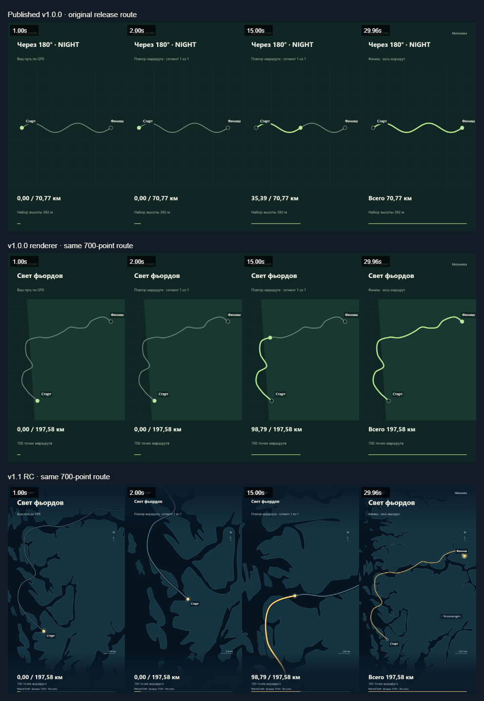

# Cinematic v1.1 visual acceptance

Candidate: feature/cinematic-route-story-v1.1 / PR [#6](https://github.com/Matawaka/route-story/pull/6). Stable main/tag remains `5f39332b7358949d248da6b2f99ba445ee1b41e8`. This candidate is not deployed or published. Owner visual approval is pending; passing automated tests does not establish audience retention or physical-phone usability.

## Reproducible evidence

`node scripts/acceptance/cinematic.mjs` drives the real UI, loads the labelled 700-point synthetic fjord demo, selects Standard, exports Atlas 16:9/20s and Night 9:16/30s, independently validates H.264/MP4/duration/frames and extracts decoded intro/replay/outro frames. Local outputs are ignored under artifacts/sprint7/cinematic.

`node scripts/acceptance/comparison.mjs` extracts the immutable v1.0.0 renderer with git show and encodes the **same 700-point route**, titles, dimensions and durations for a fair controlled comparison. It also decodes the actual published v1.0.0 videos. Contact sheets explicitly distinguish the published examples (different routes) from the same-route baseline. No source MP4 is modified, retagged or replaced.

Final application checkpoint `7443166d02dd3b78225725d69707c3d7a498a6c4` was exported through the UI on 2026-10-09, Windows 10.0.26200 / Edge154.0.4258.62. No page errors or external requests. FFmpeg6.1.1 + ffprobe independently decoded every frame and verified timestamps/durations within 10µs, H.264 Constrained Baseline, MP4 and 24fps. These example times are single observations, not median benchmarks:

| Example | Dimensions / seconds / frames | Bytes | Export wall time | SHA-256 |
| --- | --- | ---: | ---: | --- |
| Atlas / landscape | 1280×720 / 20 / 480 | 11,837,253 | 5,598.7ms | 1dfb4bfc4e68de8b51cf2819453ea9616b8e0f7b1e60aeeaa6c0e348a4d65afa |
| Night / portrait | 720×1280 / 30 / 720 | 17,367,156 | 18,145.4ms | cb2604f3e086b0ca810885a82c5a9c941a04a6395cc9e131fd58fe39ef619e1c |

All 480/720 decoded frames differ over time; valid beginning and final frames inspected. Night bloom, moving detailed geography and greater bitrate utilisation materially increase cost/size versus the static release. Both remain within 32MiB payload/30s/24fps bounds. MP4s remain local review artifacts, not public v1.1 assets. Prototype evidence is separately labelled in VISUAL_UPGRADE_AUDIT.md and is not substituted for these outputs.

Contact sheets sample 1s, 2s, midpoint and final decoded frame. Additional 0s, quarter and replay-end frames exist under artifacts/sprint7/cinematic. Opening/middle/ending and both sheets were visually inspected. The middle row makes clear that detail/framing improvements are not simply consequences of switching GPX examples.

## Visual criteria and practical limits

| Criterion | Evidence / observed result |
| --- | --- |
| Visible zoom | Pure plan permits 2.65× on ordinary routes; decoded 2s/midpoint visibly closer than 0s/final |
| Controlled follow | Same-route baseline stays still; cinematic shoreline/marker position changes over actual video, bounded segment-local look-ahead |
| Opening | Complete route at 0s, prominent serif Atlas / bold Night title, eased approach in first two seconds |
| Final overview | Complete route, endpoint labels, 197.58km and 700 points visible again; subtle Matawaka |
| More geographic detail | Visible real fjords/islands/coast, sourced Vossavangen label and water layers; no invented roads |
| Different styles | Light editorial Atlas/rust versus blue-black Night/amber; both reviewed from decoded frames |
| Useful map area | Full-frame geography; former 42% opaque panels replaced by translucent margins and compact captions |
| Overlay readability | Screen-space captions remain upright; long-title/extreme-counter/endpoint checks, both qualities/aspects |
| Route visibility | Layered route/pulse. Nominal sRGB route-to-land/water contrast: Atlas 4.51/3.29 (plus light halo), Night 9.28/13.12; caption/panel 10.23/15.62. These solid-colour ratios do not claim all antialiased video pixels meet a WCAG threshold |
| Geographic integrity | Original distances/segments; finite polar/antimeridian frames, true open-Pacific water pixel, source-coordinate marker/path alignment |
| Seeking/export | Exact uncompressed pixels in eight style/aspect/quality combinations and inside the real export draw callback; same pure camera |
| Real output | Two final 20/30s MP4s independently decoded; original 4s/20s and both original 30s regressions valid |

Human inspection finds visible improvement in geographic context, camera variation and screen composition. Remaining aesthetic limits: even 1:10m coast can look angular at close scale; no streets/terrain shading; portrait overview has more open space than the follow shot; restrained typography; north-up camera and explicit fade/cut at segment gaps. Outside the regional pack local context may remain sparse. Audience retention and physical-phone readability have not been studied. Owner judgement is the remaining visual approval gate.

## Automated checks at the cartography checkpoint

Windows 10.0.26200 x64 / Microsoft Edge 154.0.4258.62 / Node 24.19.0. `PLAYWRIGHT_CHANNEL=msedge FULL_EXPORT_ACCEPTANCE=1 npm.cmd run check`: 111 unit tests, production build, 30 browser tests passed; one licensed-external-data opt-in test intentionally skipped. Full 30s Standard original 5000-point regression passed in both aspects. New exact pixel checks span both styles, both aspects and both quality presets; forward/backward seek and the export draw callback match. These compare uncompressed frames, not lossy decoded H.264 pixel identity.

New geometry coverage: finite/clamped pure camera, smooth intro/replay/outro boundaries, marker-safe framing, exact full overview endpoints, zero/short distance, high latitude, shortest-arc antimeridian, discrete disconnected segment transitions, 50,000 preserved points, no gap bridge and no false Pacific land. Missing local geography blocks export and recovers on retry. Classic/reduced motion and encoder/cancellation/error recovery are preserved. Production network/storage/privacy checks and strict package allowlist remain active.

`node scripts/acceptance/visual.mjs` with the new real geography completed 64 configurations /384 captured timestamps: dense, disconnected, antimeridian, long-distance, polar, short, coastal and extreme-distance geometry × both styles × both qualities × both aspects. No measured text bounding-box overflow or start/finish label overlap, including intro, early/middle/end replay, segment transition and outro. This checks geometry, not every possible title/track or physical phone. Raw screenshots/metrics remain under artifacts/sprint3/visual; copied report artifacts/sprint7/visual-v11.json. Actual exported-video visual review is the separate evidence above.

Identified production bundle: `npm.cmd run build`, `npm.cmd run release:package`, `EXPECTED_COMMIT=7443166d02dd3b78225725d69707c3d7a498a6c4 node scripts/acceptance/release.mjs --smoke` VERIFIED locally under /route-story/. All 13 manifest hashes, required assets/licenses, actual Standard10s/240-frame outputs in both aspects, native playback, cancellation/retry, unsupported-encoder error, empty storage and first-party-only requests passed. Version compared exactly with package1.1.0-rc.1; expected published-version override remains explicit. An initial setup invocation lacked the freshly regenerated manifest after Vite cleared dist; this was corrected by rebuilding the package before acceptance. This is local candidate acceptance, **not** public HTTPS validation or deployment. Restrictive meta CSP active; no unobserved response-header protection is claimed.

`PLAYWRIGHT_BROWSERS_PATH=.reference/browsers node scripts/acceptance/compatibility.mjs`: Edge154.0.4258.62, Chrome154.0.8037.98, Playwright Firefox157.0 and Chromium156.0.8078.4 with Pixel5 emulation VERIFIED preview/seeking, both styles, both qualities/aspects, four actual 10s H.264 exports per environment, independent decoding/native playback and no external requests/storage. Playwright WebKit27.2 on Windows VERIFIED preview; H.264 export UNSUPPORTED (VideoEncoder absent), clear error with preview retained. Emulation uses desktop encoding, not physical Android verification. Report: CINEMATIC_EVIDENCE.json.

GPU VRAM, dedicated codec memory, Linux/macOS export, physical Android/iOS and Safari are NOT TESTED for this candidate. Native process memory is described separately in PERFORMANCE.md. Package/export ceilings are bounds, not proof of universal memory safety.
