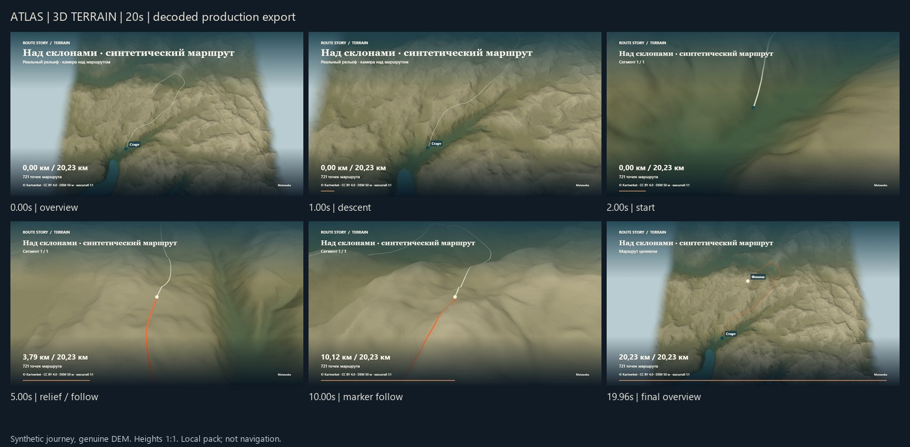
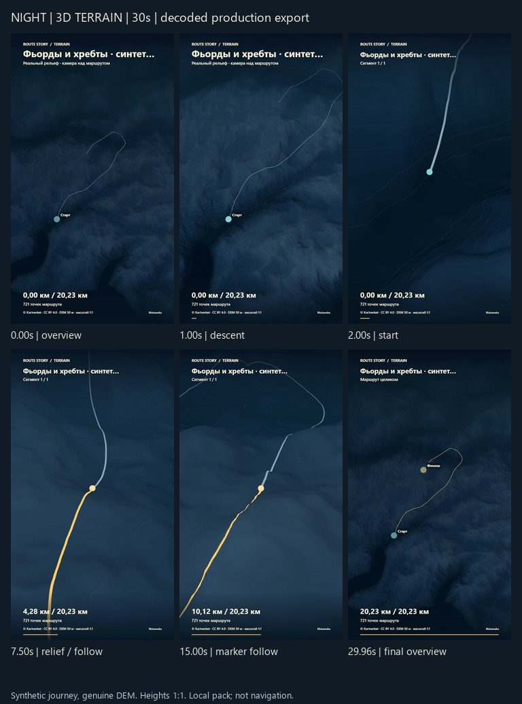
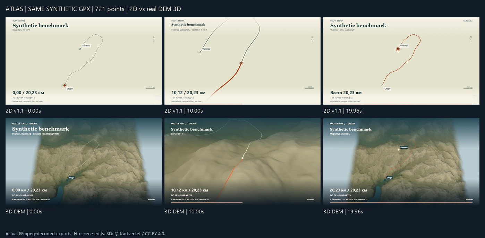
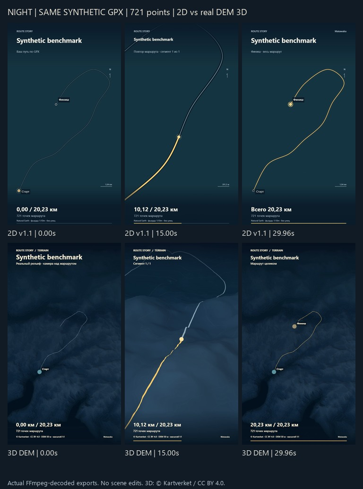
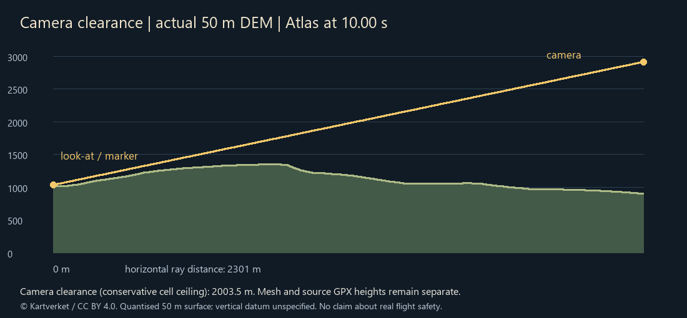

# Terrain camera and decoded-video acceptance

Local owner-review candidate, 2026-10-09. Application acceptance commit `0edebbf31db8c32f1c7e1dbeeac4f1b812bb8562`, based on Sprint 7 `a704f67269478190d4c38a77400ed4a04b0faea1`. [Stacked PR #7](https://github.com/Matawaka/route-story/pull/7) targets PR #6. Stable main/tag/site v1.0.0 are unchanged. No new public HTTPS deployment or physical-mobile acceptance is claimed.

## Actual videos

Created with the real production UI at local `/route-story/`, using `scripts/acceptance/terrain.mjs --production`. Both use the public, explicitly synthetic 721-point Sogne sample, 20.230452 km, with genuine Kartverket DEM. Synthetic geometry is not a recorded hike or a verified walking trail. No invented GPS elevation/timestamps.

| Output | Dimensions / duration | Independently decoded | Bytes | Export wall time, one observation |
| --- | --- | --- | --- | --- |
| `artifacts/sprint8/final/atlas-20s.mp4` | 1280×720 / 20.000s | H.264 Constrained Baseline, 24fps,480/480 frames | 12,812,946 | 1190.1ms |
| `artifacts/sprint8/final/night-30s.mp4` | 720×1280 / 30.000s | H.264 Constrained Baseline, 24fps,720/720 frames | 17,894,633 | 1662.5ms |

Atlas SHA256 `2ad43337817337f4aa6e4ee3e3356b48d9d984171f876acb205cbfbe4bba6ada`; Night SHA256 `b2a9898056be0ecd2777ebf6abf6cb4dd0d0a5d357de06b87e9981edb430945f`. These files are local ignored review artifacts, **not published release assets**. Regeneration can produce different bytes; revalidate and record new hashes.

Independent FFmpeg6.1.1/ffprobe validation decodes every frame without errors, verifies timestamps/dimensions/fps/duration/frame count, and finds480/720 distinct frame hashes. A separate every-frame central-map luma check excludes the HUD; minimum YMAX−YMIN is129 Atlas /155 Night, above the8-level blank-frame rejection threshold. This contrast check alone does not prove geographical correctness; mesh tests, camera checks and visual inspection provide complementary evidence. Representative beginning/descent/replay/final frames were inspected at full resolution. These are real rendered mountain meshes with normals/depth, not a skewed flat screenshot.





## Controlled 2D versus 3D

Same721-point GPX, title “Synthetic benchmark”, style, quality, aspect, durations and timestamps. Source MP4s are `artifacts/sprint8/performance-final/{cinematic,terrain}-standard-{landscape,portrait}.mp4`; application renderer commit `b3937e75430a5a656f765d2f3f89687385d3fb87`. The later acceptance commit changes Auto selection/acceptance tooling, not these rendering paths. Contact sheets resize decoded pixels and add outside-frame captions; no geography/lighting was retouched. S7's original different-route examples remain in their existing validation record.





## Camera safety and determinism

`node scripts/acceptance/terrain-camera.mjs` audits the actual pack every1/24s, including both exact endpoints;481 states at20s,721 at30s. A pure timestamp function produces geographic/local position, altitude, target, bearing, pitch, fixed46° FOV and zero roll. It independently rechecks visibility, not previous frames. Forward/backward state identity and start/final overview identity pass. Active replay target stays in caption-safe screen space.

| Actual-pack case | Height range | Pitch range | Minimum conservative camera clearance | Minimum independently sampled ray clearance |
| --- | --- | --- | --- | --- |
| 640×360,20s,100m DEM | 2259.5–26490.1m | 35.66–84.53° | 1020.9m | 20.51m |
| 1280×720,20s,50m DEM | 2260.7–26495.1m | 35.65–84.53° | 1018.3m | 4.41m |
| 720×1280,30s,50m DEM | 2259.2–39104.4m | 35.65–84.16° | 1027.0m | 7.67m |

Clearance is relative to this derived DEM with unspecified source vertical datum, not surveyed absolute altitude or real aircraft safety. Overview heights are intentionally high to include the entire20km path with portrait safe margins. Maximum24fps position steps1064/1064/1612m occur in the overview transition; these are compressed-video camera motion, not historical travel speed. Replay shots vary with local relief and actual path direction, with bounded look-ahead. The current planner uses a2km neighbourhood height range and smoothed route tangent; it is not a general slope/curvature classifier or a flight simulator.

Safety envelope is ≥maximum grid elevation+350m, including interpolated positions; exact triangular LOS tests visit every grid edge/diagonal and the near-target clearance-ramp breakpoint. The independent audit samples129 points along each ray. Unit tests additionally use501 samples/ray across cliffs, valleys, passes, fjords and narrow ridges, including transitions. A conservative envelope prevents low valley passes; this is a deliberate reliability tradeoff. No guarantee is made against10m-source features omitted by50/100m resampling.



The plotted profile is calculated from the actual50m grid and Atlas10s camera, not decorative mountain geometry. Route source elevation remains separate from drape/marker altitude.

### Defect found by full-timeline audit

The first integrated candidate contained two real defects: a reserved GLSL name prevented the route shader drawing (caught from decoded pixels), and straight interpolation of intro/outro gaze could enter a ridge. Replay-only synthetic tests missed the latter. The actual-pack full-timeline audit failed with below-ground gaze, height up to3.48million metres and almost empty frames. These candidate files are superseded, not accepted evidence.

Shader errors now reject readiness/frame/export. Transition gaze is clamped above exact mesh+24m before LOS, below-ground target inputs reject, flight rejects non-finite or>80km altitude. Dense-ray regressions cover intro and outro as well as replay. Final videos were regenerated after the fix, then all decoded geographic frames checked. Exact endpoints remain canonical and reversible.

## Geometry, resource and functional regressions

131 unit tests pass, including DEM dimensions/range/no-data, local near-antimeridian/polar coordinates, exact triangle drape, source elevation preservation, distance-based boundaries, stationary duplicates, coverage holes, caption-safe framing and local-relief Auto selection. No real Norway DEM is claimed near the antimeridian/poles; synthetic terrain exercises that math, while real uncovered imports retain2D recovery.

Browser tests check both styles×aspects×quality presets: eight actualGPU scenes, finite vertices/normals, upward mesh winding, bounds, actual-height overview framing, visible route pixels, depth testing, reversible pixel identity, and preview/export callback pixel identity at an exact timestamp. These checks are within a controlled renderer; cross-vendor bitwise equality is not promised. Source GPX elevations remain77m in the disconnected/stationary regression, independent of DEM; individual centre-trace pairs cannot bridge segments.

Tests exercise corrupt/missing DEM, failed WebGL creation with route retained, unsupported H.264 with preview retained, a genuinely invalid GLSL program rejecting export and clearing temporary canvases, actual context loss/disposal, cancellation/retry and independent10s Compatibility decoding. Existing safe XML, GPX/segment/antimeridian/timeline/privacy/export tests remain in the suite. Existing4s and20s Standard regressions pass; the opt-in5000-point30s Standard2D outputs in both aspects passed in the full run before the final3D-only transition/Auto refinements. Actual final3D30s portrait and50k landscape outputs independently decode720frames.

Local production acceptance verifies HTTP200, secure localhost context, `/route-story/` paths, all19 manifest file hashes, local JS/CSS/maps/DEM/licenses, restrictive HTML meta CSP,0 bad responses/0 cross-origin or non-GET requests,0 WebSockets, empty localStorage/sessionStorage/IndexedDB and no393px viewport overflow. No response-header CSP or public HTTPS success is inferred from this local test. Stable public v1.0 remains separately deployed.

## Visual issues for owner review

- The30×40km pack remains visibly regional at wide Atlas overview; edge fade is presentation, not invented terrain.
- Conservative flight stays high; close canyon flights and terrain shadows/bloom are postponed.
- Ribbon can be occluded by real slopes; a depth-tested1px centre trace improves overview/turn continuity without drawing through mountains.
- Portrait long titles use ellipsis; chosen title/config/source remain intact. Dark Night should be assessed on the owner's display; no physical-phone usability claim.
- No bridge/tunnel altitude, satellite textures, real weather, world DEM, road/place inference or verified GPX ascent from missing elevations.

Owner should review both full MP4s and the transition sequence before approving a merge or v1.1 publication. No audience-retention claim, contest update or automatic deployment.

## Reproduction

```powershell
npm.cmd ci
$env:PLAYWRIGHT_CHANNEL = 'msedge'
npm.cmd run check
npm.cmd run release:package
node scripts/acceptance/terrain.mjs --production
node scripts/acceptance/terrain-camera.mjs
# Optional installed test engines; existing .reference/browsers or normal Playwright cache
$env:PLAYWRIGHT_BROWSERS_PATH = '.reference/browsers'
node scripts/acceptance/terrain-compatibility.mjs
```

MP4s/reports remain under ignored `artifacts/sprint8/`. `scripts/terrain/evidence.py` with Pillow recomposes contact sheets from actual outputs and a grid-derived clearance profile. Compact sanitized results: [TERRAIN_EVIDENCE.json](TERRAIN_EVIDENCE.json); provenance: [TERRAIN_DATA_SOURCES.json](TERRAIN_DATA_SOURCES.json); timing/memory: [TERRAIN_PERFORMANCE.md](TERRAIN_PERFORMANCE.md).
